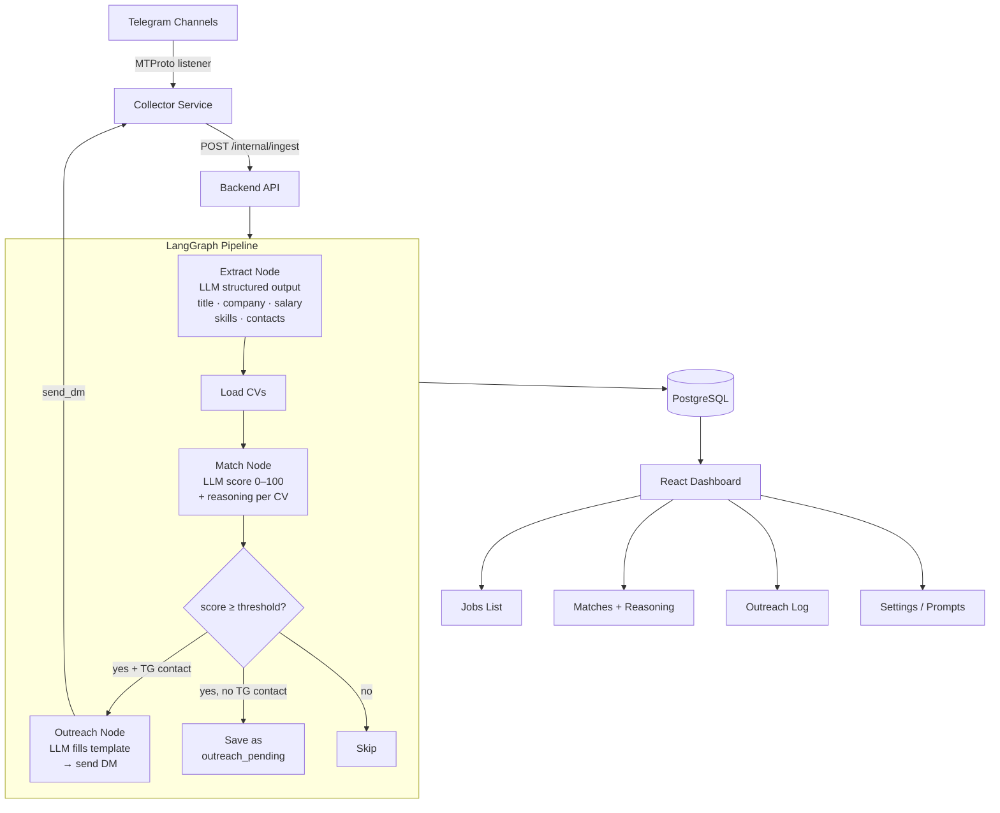

# tg-job-collector

Automated Telegram job posting collector with LLM extraction, CV matching, and outreach via direct messages.

Monitor job channels → extract structured data → match against your CVs → send personalized DMs to the best matches.

## How it works



## Setup

### 1. Get Telegram API credentials

Go to [my.telegram.org](https://my.telegram.org) → API Development Tools → create an app. Copy `api_id` and `api_hash`.

### 2. Configure environment

```bash
cp .env.example .env
```

Edit `.env` and fill in:

| Variable | Description |
|---|---|
| `TELEGRAM_API_ID` | From my.telegram.org |
| `TELEGRAM_API_HASH` | From my.telegram.org |
| `OPENROUTER_API_KEY` | From [openrouter.ai](https://openrouter.ai) |
| `ADMIN_PASSWORD` | Your login password for the web UI |
| `SECRET_KEY` | Random string (32+ chars) for JWT signing |
| `INTERNAL_SECRET` | Random string shared between backend and collector |
| `POSTGRES_PASSWORD` | PostgreSQL password |

### 3. Run

```bash
docker compose up --build
```

Open [http://localhost:5173](http://localhost:5173).

### 4. Onboarding

The first login redirects to a setup wizard:

1. **Telegram Auth** — scan the QR code with your Telegram mobile app
2. **Upload CVs** — add PDF or text CVs, set match threshold per CV (default 70/100)
3. **Validate Prompts** — review and test the LLM prompts for extraction, matching, and outreach
4. **Select Channels** — choose which Telegram channels to monitor from all your joined channels

After setup, job posts are collected and processed automatically in real time.

## Features

- **Real-time collection** — Telethon MTProto listener catches new posts instantly
- **Structured extraction** — LLM extracts title, company, location, salary, tech stack, experience, and all contact info (Telegram, email, phone, links)
- **Smart matching** — each job is scored against every CV with a human-readable explanation
- **Auto outreach** — DMs are sent automatically when score exceeds your threshold and a Telegram contact is available
- **Prompt editor** — all three LLM prompts are editable in the UI with live test capability
- **Model switching** — change the OpenRouter model in settings at any time

## Architecture

```
browser
  └── React SPA (port 5173)
        └── FastAPI backend (port 8000)
              ├── PostgreSQL (internal)
              └── Collector / Telethon (internal, not exposed)
```

The collector service is isolated on an internal Docker network — it is never reachable from outside the host. Communication between collector and backend uses a shared secret header.

## Default LLM models

The system works with any model available on [OpenRouter](https://openrouter.ai/models). Recommended starting points:

- `openai/gpt-4o-mini` — fast and cheap, good extraction quality (default)

## Production deployment

```bash
docker compose -f docker-compose.yml -f docker-compose.prod.yml up --build -d
```

Add a `Caddyfile` with your domain for automatic HTTPS. The prod compose adds a Caddy reverse proxy in front of the backend and frontend.

## Project structure

```
tg-job-collector/
├── backend/          FastAPI + LangGraph + SQLAlchemy
│   └── app/
│       ├── auth/
│       ├── channels/
│       ├── jobs/
│       ├── cvs/
│       ├── matches/
│       ├── outreach/
│       ├── settings/
│       ├── collector/   proxy + ingest endpoint
│       └── pipeline/    LangGraph extract→match→outreach
├── collector/        Telethon service (MTProto)
└── frontend/         React + Vite + TypeScript
```
